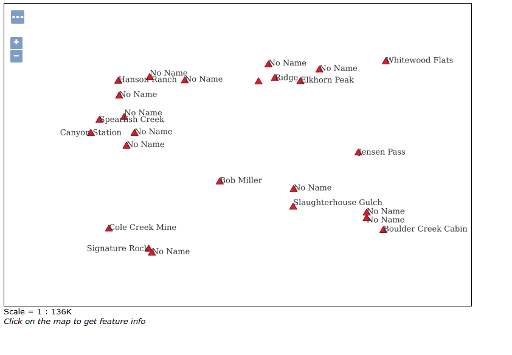

Q1: What is the URL of the WMS GetCapabilities request?

https://crispy-space-barnacle-5gx5wwpqxxw4f7965-8080.app.github.dev/geoserver/ows?service=WMS&version=1.3.0&request=GetCapabilities

Q2: What is the URL of the WFS GetCapabilities request?

https://crispy-space-barnacle-5gx5wwpqxxw4f7965-8080.app.github.dev/geoserver/ows?service=WFS&acceptversions=2.0.0&request=GetCapabilities

Q3: Submit a screenshot of your updated WFS Layer Preview

Q4: What does drawing order refer to? Which layer goes on top, the first or the last layer in the list?

The last layer in the list goes on top.

Q5: Submit a screenshot of the Layer Preview of the Spearfish Layer Group when sf:sfdem is listed as the 3rd layer.

Q6: What is the WMS url for the single-tiled request?

https://crispy-space-barnacle-5gx5wwpqxxw4f7965-8080.app.github.dev/geoserver/wms?SERVICE=WMS&VERSION=1.1.1&REQUEST=GetMap&FORMAT=image%2Fpng&TRANSPARENT=true&STYLES&LAYERS=spearfish&exceptions=application%2Fvnd.ogc.se_inimage&SRS=EPSG%3A26713&WIDTH=1900&HEIGHT=1000&BBOX=589977.282456448%2C4915860.179494634%2C608110.754424794%2C4925404.112109553

Q7: What is the WMS url for one of the tiled requests? What is the image size?

https://crispy-space-barnacle-5gx5wwpqxxw4f7965-8080.app.github.dev/geoserver/wms?SERVICE=WMS&VERSION=1.1.1&REQUEST=GetMap&FORMAT=image%2Fpng&TRANSPARENT=true&tiled=true&STYLES&LAYERS=spearfish&exceptions=application%2Fvnd.ogc.se_inimage&tilesOrigin=589425.9342365642%2C4913959.224611808&WIDTH=256&HEIGHT=256&SRS=EPSG%3A26713&BBOX=605925.1938559785%2C4930471.940328075%2C610811.687354817%2C4935358.433826913

Image size: 256x256

Q8: What is the URL of your coarse resolution sample of a WMTS url? What level does this tile refer to? Notice the differences. What are some of the fields that are unique to this url?

https://crispy-space-barnacle-5gx5wwpqxxw4f7965-8080.app.github.dev/geoserver/gwc/service/wmts?layer=spearfish&style=&tilematrixset=EPSG%3A4326&Service=WMTS&Request=GetTile&Version=1.0.0&Format=image%2Fpng&TileMatrix=EPSG%3A4326%3A13&TileCol=3468&TileRow=2075

Level: 13

TileMatrix, TileCol, TileRow

Q9: In the zoomed-out URL, what are the TileCol and TileRow?

https://crispy-space-barnacle-5gx5wwpqxxw4f7965-8080.app.github.dev/geoserver/gwc/service/wmts?layer=spearfish&style=&tilematrixset=EPSG%3A4326&Service=WMTS&Request=GetTile&Version=1.0.0&Format=image%2Fpng&TileMatrix=EPSG%3A4326%3A12&TileCol=1732&TileRow=1038

TileCol: 1732
TileRow: 1038

Q10: In the zoomed-in URL, what are the TileCol and TileRow?

https://crispy-space-barnacle-5gx5wwpqxxw4f7965-8080.app.github.dev/geoserver/gwc/service/wmts?layer=spearfish&style=&tilematrixset=EPSG%3A4326&Service=WMTS&Request=GetTile&Version=1.0.0&Format=image%2Fpng&TileMatrix=EPSG%3A4326%3A19&TileCol=222103&TileRow=132729

TileCol: 222103
TileRow: 132729

Q11: Why are they so different for the same location in the map?

As you zoom in on the map there are more columns and rows

Q12: Is there a difference in the TileMatrix? %3A is an HTML encoding for a colon, :.What does the number after EPSG:4326 mean?

Yes, the number after EPSG:4326 changes. Zoomed out is 12. Zoomed in is 19. The number after refers to the Zoom Level of the map.

